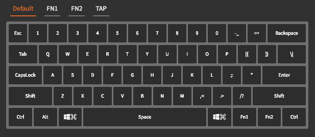
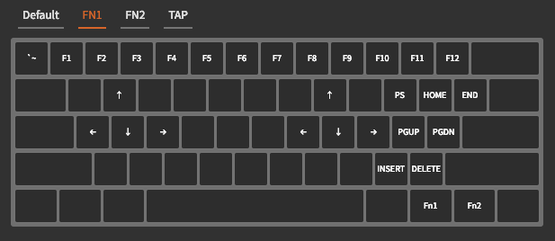
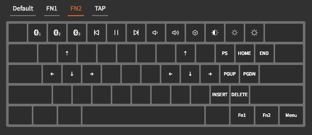
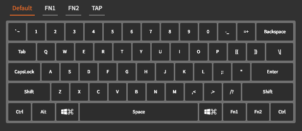
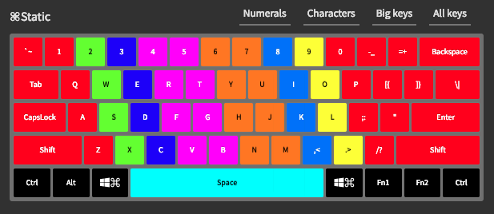
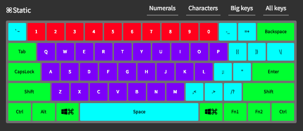

# MacOS Anne Pro

Configuration files for developers using a Mac and an Anne Pro.

## Key layouts

### MacOS-Freedom

There are just two layouts right now. I substituted the CMD-Option-CTRL to mimic the ones in an original keyboard. On the right side of space, tho, there's space for the CMD only. I changed the FN2 keys to be useful with multimedia. No one needs 4 devices, right?

### MacOS-intl

Same as the previous one, but I changed the ESC to work as the FN1 layout by default. Sorry to the VIMmers, but I need accents when writing in Italian.

## Lighting layouts

### TouchTyping

This layout shows the fingers to be used when touchtyping.

### Letters vs. Specials

This layout highlights the letters, special chars and function keys. Not that it is useful, but I liked how it looked.

## Contributing

Feel free to fork the repo and create pull requests! I'd love to see your templates.
